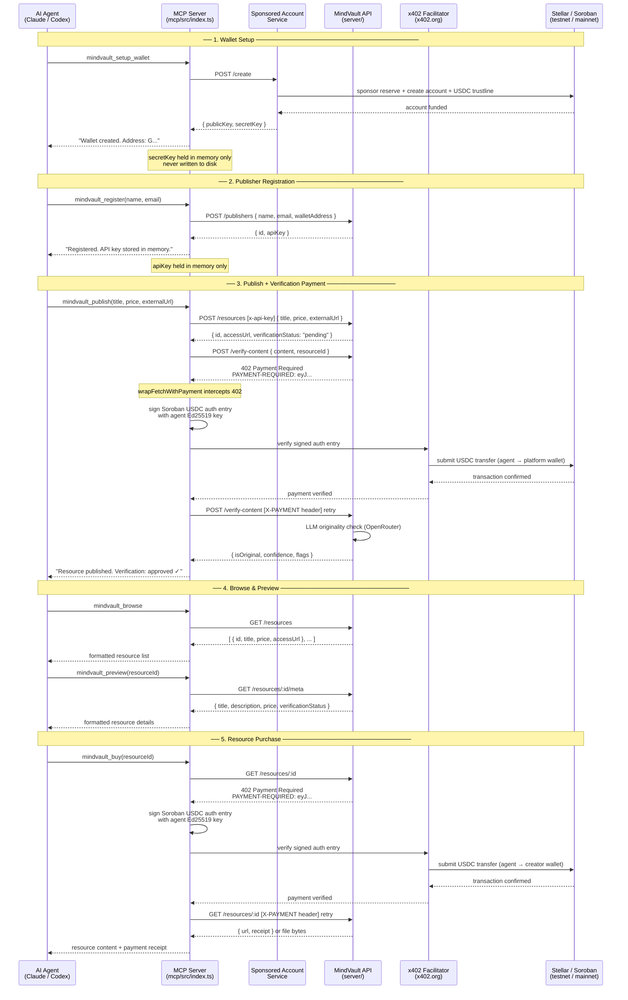

# MCP Architecture — Agent Flow

This document describes how an AI agent (Claude Code, Codex, or any MCP-enabled client) interacts with MindVault through the MCP server.

The MCP server is a thin adapter layer. It translates natural-language tool calls into HTTP API requests and x402 payment flows, then returns results as text. The agent never touches Stellar or Soroban directly — the MCP server handles wallet management, payment signing, and x402 negotiation.

---

## Flow Diagram

---

## Call Types

| Arrow | Protocol | Description |
|-------|----------|-------------|
| Agent → MCP | MCP (stdio) | Tool call via Model Context Protocol |
| MCP → Sponsored | HTTPS | REST: create sponsored Stellar account |
| MCP → API | HTTPS | REST: resource and publisher operations |
| MCP → Facilitator | HTTPS | x402: verify payment auth entry |
| Facilitator → Stellar | Soroban RPC | Submit USDC transaction on-chain |

---

## In-Memory State

The MCP server holds two pieces of ephemeral state across tool calls within a session:

| State | Set by | Used by |
|-------|--------|---------|
| `agentWallet` `{ publicKey, secretKey }` | `mindvault_setup_wallet` | `mindvault_register`, `mindvault_publish`, `mindvault_buy`, `mindvault_wallet_info` |
| `agentApiKey` | `mindvault_register` | `mindvault_publish` |

Both are lost when the MCP server process exits. A new session requires running `mindvault_setup_wallet` and `mindvault_register` again, or pre-loading an existing wallet by setting `AGENT_SECRET_KEY` and `AGENT_API_KEY` environment variables if you extend the server.

---

## Tool Summary

| Tool | API Call(s) | Stellar/Soroban |
|------|-------------|-----------------|
| `mindvault_setup_wallet` | `POST /create` (sponsored service) | Creates account + trustline |
| `mindvault_wallet_info` | Horizon `/accounts/:key` | Reads USDC balance |
| `mindvault_browse` | `GET /resources` | None |
| `mindvault_preview` | `GET /resources/:id/meta` | None |
| `mindvault_register` | `POST /publishers` | None |
| `mindvault_publish` | `POST /resources`, `POST /verify-content` (x402) | Signs + settles USDC payment to platform wallet |
| `mindvault_buy` | `GET /resources/:id` (x402) | Signs + settles USDC payment to creator wallet |
| `mindvault_agent_status` | `GET /agent/status` | None |

---

## Environment Variables (MCP Server)

| Variable | Default | Description |
|----------|---------|-------------|
| `MINDVAULT_URL` | `https://mindvault-hyr3.onrender.com` | MindVault API base URL |
| `SPONSORED_ACCOUNT_URL` | `https://stellar-sponsored-agent-account.onrender.com` | Sponsored account service URL |
| `HORIZON_URL` | `https://horizon-testnet.stellar.org` | Stellar Horizon for balance queries |

The MCP server has no `.env` file of its own — pass variables via your MCP client config or shell environment.
