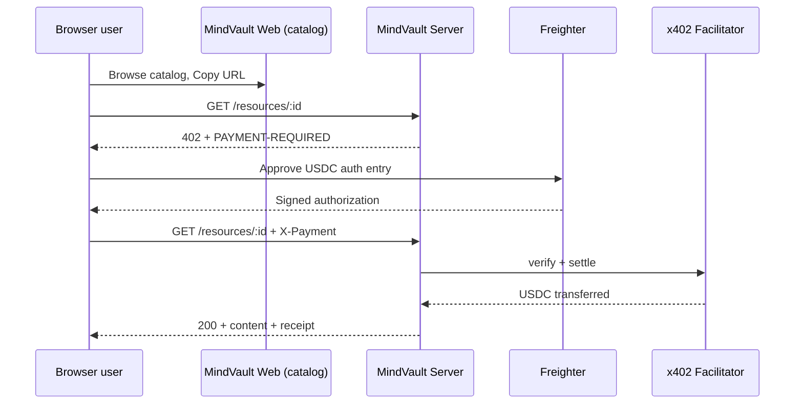

# x402 Browser Payment Walkthrough

This guide walks through the **browser buyer path**: finding a resource in the MindVault web catalog, opening its paywalled URL, signing a USDC payment with a Stellar browser wallet, and receiving the protected content.

For the full protocol sequence (verify → settle → deliver), see the [x402 buy/pay sequence diagram](x402-sequence-diagram.md).

---

## Prerequisites

Before buying a resource from the browser:

1. **Freighter installed and unlocked** — see [wallet connection troubleshooting](wallet-connection-troubleshooting.md).
2. **Stellar Testnet selected** in Freighter (MindVault demo deployments use `stellar:testnet`).
3. **Testnet USDC funded** — enough to cover the resource price plus a small fee buffer. See [Stellar testnet funding](stellar-testnet-funding.md).
4. **USDC trustline** on your classic Stellar account (required before sending USDC).

---

## Step 1: Find a resource in the web catalog

1. Open the MindVault web app (local: `http://localhost:5173`, or your deployed URL).
2. Browse the catalog grid. Each card shows the title, price in USDC, verification status, and owner wallet.
3. Click **Copy URL** on the resource you want to buy.

The copied URL is the resource's `accessUrl` — a direct link to the server's paywalled endpoint:

```
https://<server>/resources/<resource-id>
```

> **Web implementation note:** The catalog (`web/src/App.tsx`) does not embed an in-app purchase button. Buyers pay by opening this `accessUrl`. The server enforces the x402 paywall on `GET /resources/:id` (`server/src/routes/resources.ts`).

---

## Step 2: Open the resource URL — initial 402 response

Paste the copied URL into a new browser tab (or navigate to it directly).

If you have **not** yet paid, the MindVault server responds with:

```http
HTTP/1.1 402 Payment Required
PAYMENT-REQUIRED: eyJ4NDAy...   (base64-encoded JSON)
```

### What is in `PAYMENT-REQUIRED`?

The `@x402/express` middleware (`server/src/middleware/dynamicPaywall.ts`) builds payment instructions from the on-chain vault-registry price and the resource owner's wallet. After decoding the header, the payload includes:

| Field | Meaning |
|-------|---------|
| `price` | USDC amount to pay (read from chain when registered) |
| `payTo` / destination | Creator's Stellar G-address (`walletAddress`) |
| `network` | Stellar network id (e.g. `stellar:testnet`) |
| `asset` | Soroban USDC Stellar Asset Contract id |
| `scheme` | `exact` — pay the listed price exactly |

The server validates the database price against the on-chain registry **before** returning 402. If they disagree, you get `409 price_mismatch` instead of a payment prompt.

### Plain browser behavior

A normal browser tab **stops at HTTP 402** — it does not sign or retry automatically. An x402-aware client must read `PAYMENT-REQUIRED`, sign a Soroban USDC authorization entry, and retry the same URL with an `X-Payment` header.

---

## Step 3: Sign the payment with a Stellar browser wallet

An x402-aware browser client performs these steps (see [x402 on Stellar](https://developers.stellar.org/docs/build/agentic-payments/x402)):

1. **Decode** the `PAYMENT-REQUIRED` header.
2. **Build** a Soroban authorization entry for a USDC transfer from your wallet to the creator's `payTo` address.
3. **Sign** the entry with your Stellar keypair via a browser wallet extension.

### Freighter in MindVault today

The web app connects Freighter through `useWalletConnection` (`web/src/hooks/useWalletConnection.ts`) for wallet identity in the catalog header. Publisher flows (on-chain registration, price changes) use `window.freighterApi.signTransaction()` in modals such as `RegisterModal`.

For **resource purchases**, the signing step is the same class of wallet approval — your extension must sign the x402 Soroban auth entry for the USDC transfer. When Freighter opens:

1. Confirm the network shows **Testnet** (not Public Global).
2. Review the USDC amount and recipient (the resource creator).
3. Click **Approve** to sign.

> **Tip:** If the popup is blocked, allow popups for the MindVault site. See [wallet connection troubleshooting — popup blocked](wallet-connection-troubleshooting.md#popup-blocked-or-browser-permission-issues).

After signing, the client attaches the signed authorization as a base64 `X-Payment` header and **retries** the same `GET /resources/:id` request.

---

## Step 4: Settlement (server + facilitator)

On the retry, the server (`@x402/express` via `server/src/lib/x402.ts`):

1. Sends the signed auth entry to the **x402 facilitator** (`FACILITATOR_URL`, default `https://www.x402.org/facilitator`) for `/verify`.
2. On success, calls `/settle` to submit the USDC transfer on Stellar testnet.
3. USDC moves **directly from buyer → creator**; MindVault takes no cut of the resource price.

If verification or settlement fails, the server returns another `402` or `500` — see [troubleshooting](#troubleshooting) below.

For the full multi-party sequence, see the [x402 sequence diagram](x402-sequence-diagram.md).

---

## Step 5: Resource delivery and receipt

After successful settlement, `GET /resources/:id` returns **HTTP 200** with the protected content.

### Link resources (`resourceType: "link"`)

The response body is JSON:

```json
{
  "url": "https://example.com/protected-content",
  "receipt": {
    "paymentId": "clx...",
    "amount": "0.50",
    "currency": "USDC",
    "paidTo": "GCREATOR...",
    "paidAt": "2026-06-24T12:00:00.000Z"
  }
}
```

Open `url` to access the external content. Keep `receipt` for your records — it is also stored server-side in the `payments` table.

### File resources (`resourceType: "file"`)

The server streams the file from Supabase Storage with payment receipt headers:

```http
HTTP/1.1 200 OK
Content-Type: application/pdf
Content-Disposition: attachment; filename="report.pdf"
X-Payment-Id: clx...
X-Payment-Amount: 0.50 USDC
X-Payment-Recipient: GCREATOR...
```

The file downloads to your browser; check response headers for the receipt.

---

## End-to-end flow summary

| Step | Where | What happens |
|------|-------|--------------|
| 1 | Web catalog | Browse resources, click **Copy URL** |
| 2 | Browser → Server | `GET /resources/:id` → **402** + `PAYMENT-REQUIRED` |
| 3 | Browser wallet | Decode header, sign Soroban USDC auth entry (Freighter) |
| 4 | Browser → Server | Retry with `X-Payment` header |
| 5 | Server → Facilitator | Verify signature, settle USDC on-chain |
| 6 | Server → Browser | **200** + link JSON or file download + receipt |



---

## Troubleshooting

### Signature rejected or popup dismissed

**Symptoms:** Payment retry fails; Freighter shows a rejection or the popup closes without approval.

**Fix:**

1. Trigger the payment flow again (re-open the resource URL).
2. When Freighter opens, click **Approve** — do not close the popup.
3. Sign promptly; Soroban auth entries expire after a short ledger window.

See [wallet connection troubleshooting — rejected signature](wallet-connection-troubleshooting.md#rejected-signature).

---

### Wrong network / network mismatch

**Symptoms:** Freighter shows _"Wrong network"_; facilitator rejects the signature; transaction does not appear on testnet Explorer.

**Cause:** Freighter is on **Mainnet** but the server expects **Testnet** (`NETWORK=stellar:testnet`), or the signed auth entry was built for a different network than `PAYMENT-REQUIRED` specifies.

**Fix:**

1. Open Freighter → switch network dropdown to **Testnet**.
2. Confirm server config: `NETWORK=stellar:testnet`, `SOROBAN_RPC_URL=https://soroban-testnet.stellar.org` (see [server env](server-env.md)).
3. Fetch a fresh 402 response and sign again — do not reuse an old `X-Payment` header.

See [x402 payment troubleshooting — wrong network](x402-payment-troubleshooting.md#wrong-network-testnet-vs-mainnet).

---

### Bad or expired authorization entry

**Symptoms:** 402 on retry after signing; facilitator `/verify` rejection.

**Causes:** Price changed on-chain after signing, auth entry expired, or stale `X-Payment` header reused.

**Fix:** Open the resource URL again to get a fresh `PAYMENT-REQUIRED` header, sign immediately, and retry once.

See [x402 payment troubleshooting — bad or expired authorization](x402-payment-troubleshooting.md#bad-or-expired-authorization-entry).

---

### Insufficient USDC or missing trustline

**Symptoms:** Signing succeeds but settlement fails; balance too low; trustline errors.

**Fix:** Fund testnet USDC from [faucet.circle.com](https://faucet.circle.com) and add a USDC trustline in Freighter. See [Stellar testnet funding](stellar-testnet-funding.md).

---

### HTTP 402 but client never retries

**Symptoms:** Browser tab shows only "402 Payment Required" with no follow-up.

**Cause:** Plain browsers are not x402-aware. Something must implement the sign-and-retry loop.

**Fix:** Use an x402-capable client. For automated testing, run `pnpm --filter @mindvault/server e2e`. For agents, use the [MCP quickstart](mcp-quickstart.md).

See [x402 payment troubleshooting — 402 never retries](x402-payment-troubleshooting.md#http-402-returned-but-the-client-never-retries).

---

## See also

- [x402 buy/pay sequence diagram](x402-sequence-diagram.md) — full verify/settle protocol
- [x402 payment troubleshooting](x402-payment-troubleshooting.md) — facilitator, balance, and client failures
- [Wallet connection troubleshooting](wallet-connection-troubleshooting.md) — Freighter install, network, popups
- [Stellar testnet funding](stellar-testnet-funding.md) — fund XLM and USDC before paying
- [Architecture overview](architecture.md) — how x402 and the vault-registry fit together
