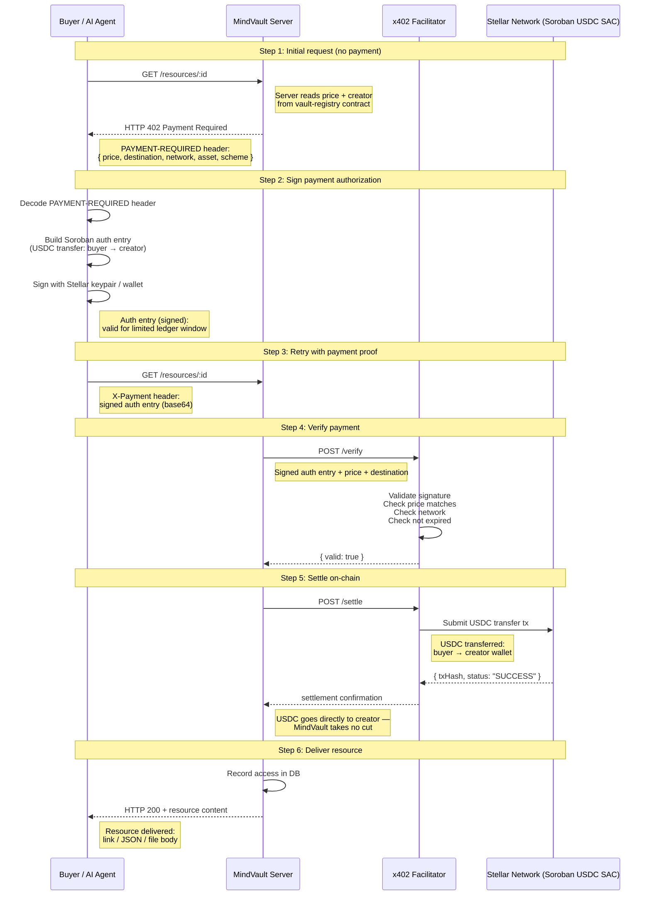

# x402 Buy/Pay Flow — Sequence Diagram

This diagram walks through the full x402 payment flow: from the initial resource request through payment, verification, settlement, and final delivery.

## Flow summary

| Step | What happens | Protocol |
|------|-------------|----------|
| 1 | Client requests resource; server returns 402 with payment details | HTTP 402 + `PAYMENT-REQUIRED` header |
| 2 | Client builds and signs a Soroban USDC authorization entry | Stellar Soroban auth |
| 3 | Client retries with the signed auth entry in an `X-Payment` header | HTTP GET + `X-Payment` |
| 4 | Server sends auth entry to x402 facilitator for signature verification | `/verify` at `x402.org/facilitator` |
| 5 | Facilitator settles the USDC transfer on Stellar testnet | Soroban USDC SAC transfer |
| 6 | Server delivers the resource content | HTTP 200 |

## Key properties

- **No accounts or OAuth** — a Stellar keypair is all a client needs
- **Price read from chain** — the vault-registry contract is queried at request time, so price updates take effect immediately
- **Direct settlement** — USDC goes from buyer to creator; MindVault has no access to funds
- **Stateless retry** — every request is self-contained; the server does not track sessions
- **Auth entry expiry** — signed auth entries have a limited ledger window (minutes), so retries must happen promptly

## See also

- [Architecture overview](architecture.md) — system diagram and layer design
- [x402 payment troubleshooting](x402-payment-troubleshooting.md) — common failures and fixes
- [x402 protocol spec](https://www.x402.org/)
